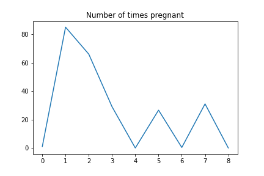
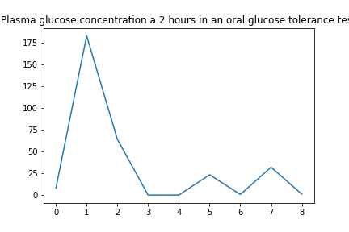
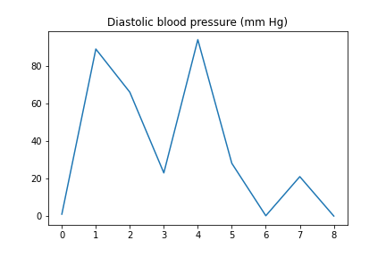
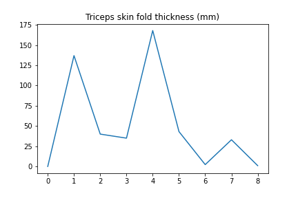
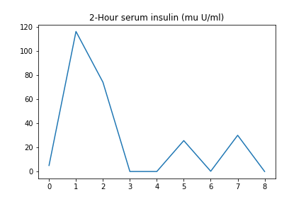
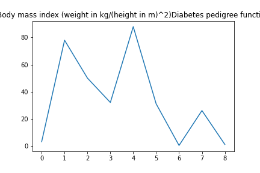
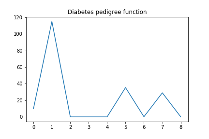
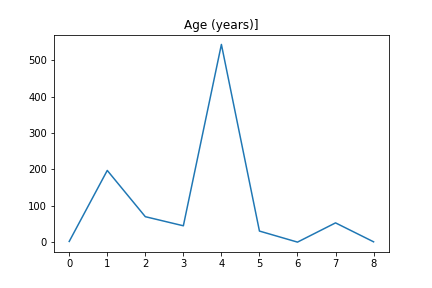

# Mô tả dữ liệu

| STT | NAME                                               |
|:---:| :-------------------------------------------------:|
|  1  | Number of times pregnant                           |
|  2  | Plasma glucose concentration a 2 hours in an oral  |
|  3  | Diastolic blood pressure (mm Hg)                   |
|  4  | Triceps skin fold thickness (mm)                   |
|  5  | 2-Hour serum insulin (mu U/ml)                     |
|  6  | Body mass index (weight in kg/(height in m)^2)     |
|  7  | Diabetes pedigree function                         |
|  8  | Age (years)                                        |
|  9  | Class variable (0 or 1)                            |

## 1. Number of times pregnant

## 2. Plasma glucose concentration a 2 hours in an oral glucose tolerance test

## 3. Diastolic blood pressure (mm Hg)

## 4. Triceps skin fold thickness (mm)

## 5. 2-Hour serum insulin (mu U/ml)

## 6. Body mass index (weight in kg/(height in m)^2)

## 7. Diabetes pedigree function

## 8. Age (years)
